# 🌟 Seara Responsive Web Application 🌟

## 📖 Description
Seara is a responsive web application designed for seamless navigation across all devices, including desktop 🖥️, tablet 📱, and mobile 📲. The project includes a product showcase 🛍️, a newsletter subscription form 📬, a cart feature 🛒, and categorized sections for products under $50 💵, under $100 💰, and for kids 🧸.

---

## 🎯 Features

### ✅ Implemented Features
- 🌐 Responsive design for all screen sizes (desktop 🖥️, tablet 📱, mobile 📲)
- 🔍 Search bar for quick navigation
- 🛒 Product grid with individual product cards
- 📬 Newsletter subscription form
- 📂 Sidebar for easy navigation through sections
- 🛍️ Cart functionality to manage selected products
- 📜 Categorized sections:
  - 💵 Under $50
  - 💰 Under $100
  - 🧸 Kids  
  *Note: Only these sections are functional.*

---

## 🛠️ Tech Stack
- **Frontend:** 🖌️ HTML, CSS, JavaScript
- **Backend:** 🖥️ Localhost for development

## Deployment
- **Frontend:** [Live Application][https://nikitha-gr.github.io/Seara/]
- **Backend:** [Glitch Deployment][https://broad-guiltless-appalachiosaurus.glitch.me/]
---

## 🗂️ File Structure

project-directory/
├── index.html        # Main HTML file
├── other html Pages  # All other pages
├── Styles/           # CSS files folder
├── Scripts/          # JavaScript folder
├── Assets/           # Images and other logos
├── README.md         # Project documentation
```

---

## 📄 Pages and Functionalities

### 🏠 Home Page
- Displays the product grid and navigation bar.
- Includes a banner for promotions.
- 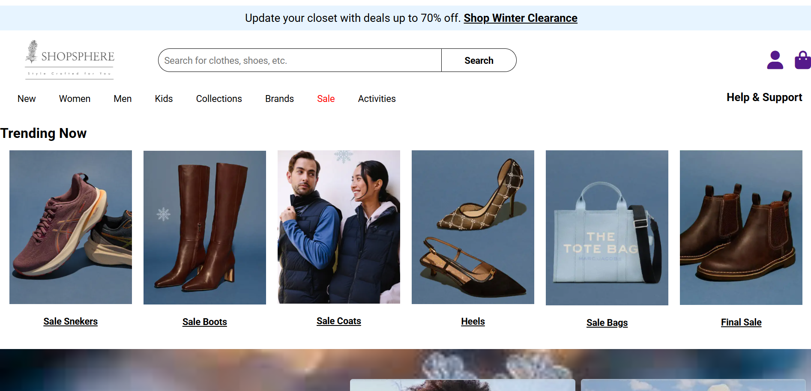

### 🎥 Poster Section
- A visually appealing section showcasing promotions or featured content.
- 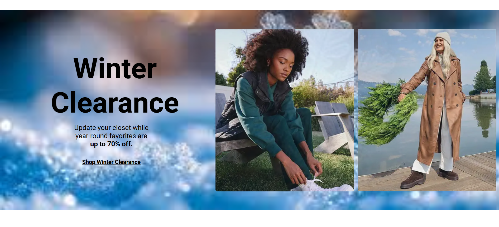

### 📂 Categorized Sections
- Separate sections for products under $50 💵, under $100 💰, and for kids 🧸.
- 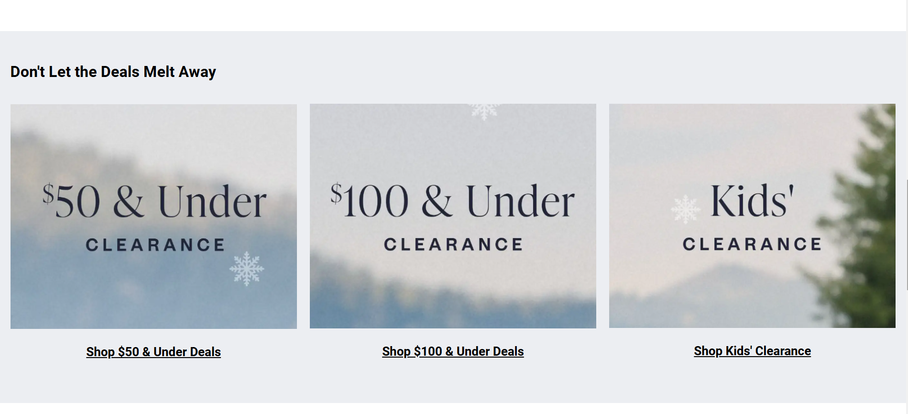
- Filtered product grids with descriptions.
- 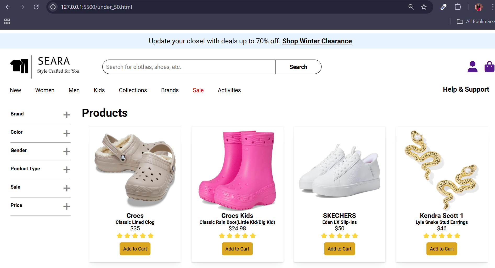
- 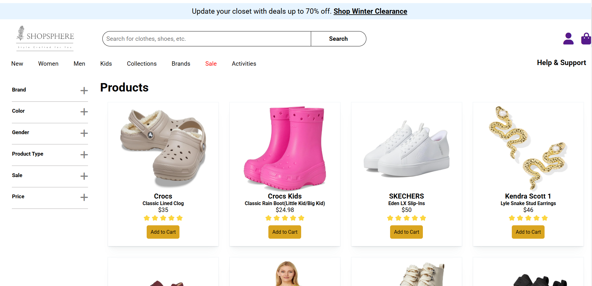
- 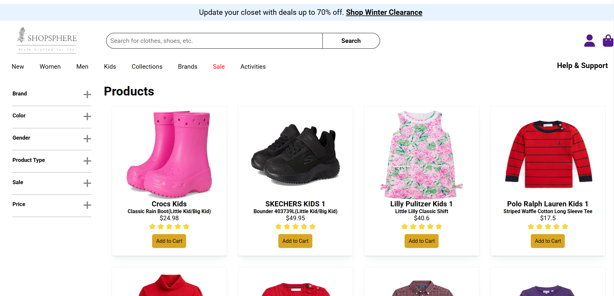

### 🔑 Login and Signup Forms
- Simple forms for user authentication.
- 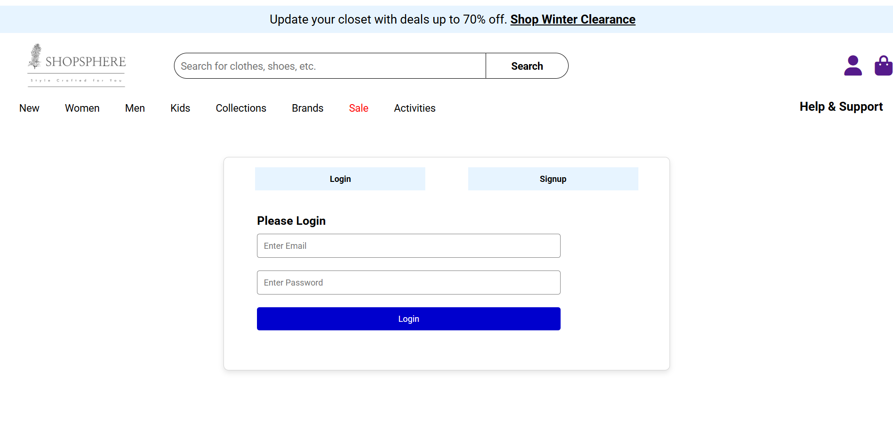
- 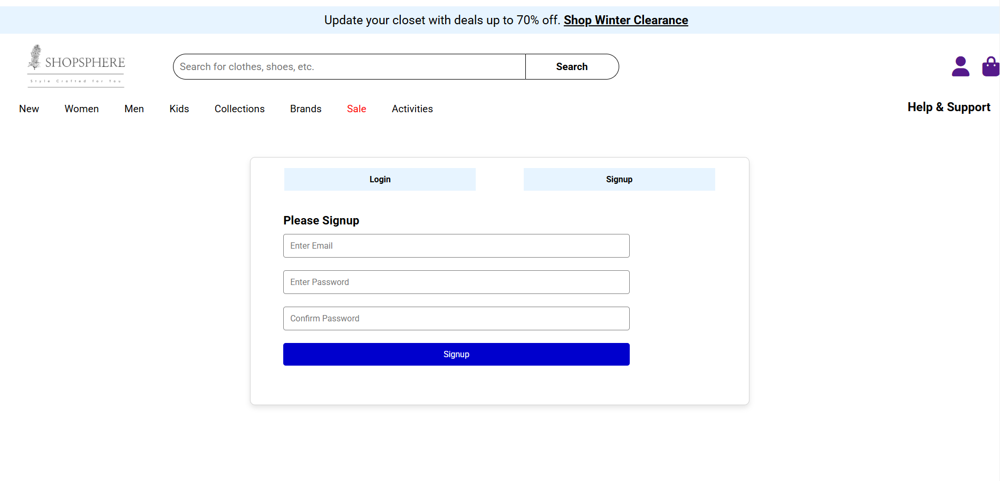

### 🛒 Cart
- Allows users to add and remove items.
- Displays a summary of selected items with total price.
- 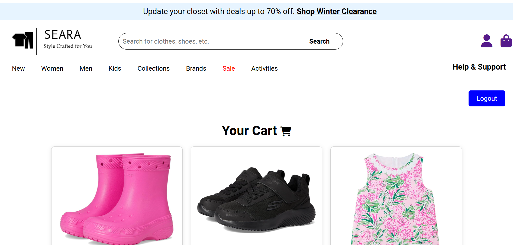
- 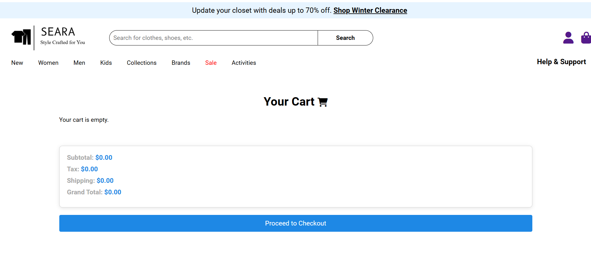

### 📬 Newsletter & Footer 
- Users can subscribe to receive updates.
- 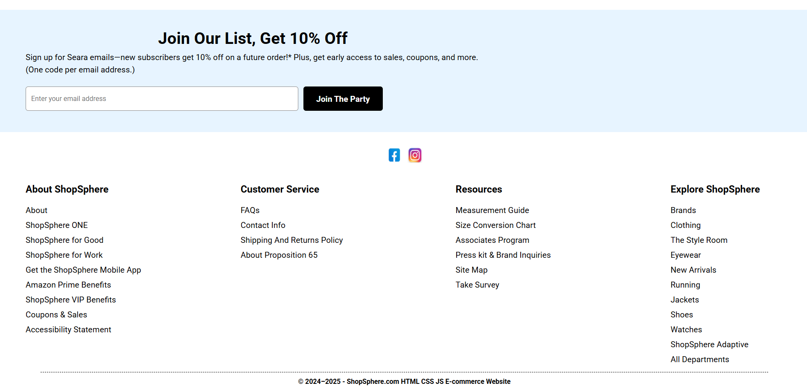

---

🎥 Video Demonstration

🔗 Watch the full demonstration of the project:  Video Demo

---

## 🐞 Known Issues
- Some links 🔗 and search bar functionalities are placeholders.
- Newsletter form lacks backend integration.
- Not all features are functioning

---

## ✨ Future Enhancements
- Integrate backend functionality for the cart 🛒 and newsletter 📬.
- Implement advanced filtering and sorting for products 🛍️.
- Add user authentication 🔐 and profile management.

---

## 📞 Contact
For any queries or contributions, please contact:
- 📧 - **Email:** (nikitha14.gr@gmail.com)
- 🐙 - **GitHub**: ([https://github.com/Nikitha-gr])